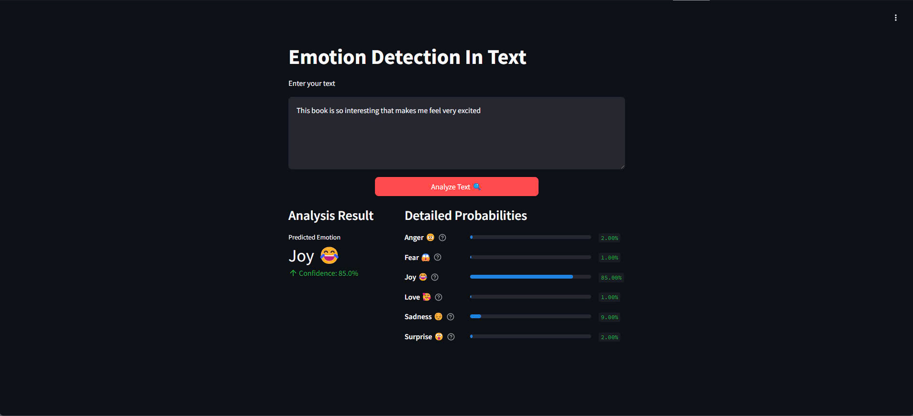

# Detect Emotion In Text

---


---

## Introduction
The Project About Detect Emotion in Text achieves quite high accuracy when used with models Support Vector Machine, Logistic Regotion, Random Forest with Accuracy respectively 93.36%, 91.17%, 89.05% on dair-ai/emotion dataset

## Dataset
The dataset used in the article is the [dair-ai/emotion](https://huggingface.co/datasets/dair-ai/emotion) dataset, which we referenced from Hugging Face. It consists of a total of 436,809 texts in lowercase, with each text labeled with one of six emotions: anger, love, surprise, fear, joy, and sadness. Notably, the labels for sadness and joy are significantly more predominant than the others.

## Project guide
### 1. Installation.
Install all the necessary libraries, use pip to install:
```bash
pip install -r requirements.txt
```

----
### 2. Load model & vectorizer
After running file Emotion_Detection_In_Text.ipynb you will received 3 file: model file, ifidf_transformer file and count_vectorizer generated during the training process. Then, add them to your #models folder so that you can run the application.
```bash
run file Emotion_Detection_In_Text.ipynb
```

---
### 3. Test
Open new terminal and then run this line:
```bash
streamlit run app.py
```
---
### 5. Hugging Face Deployment
For added convenience, this application is deployed on Hugging Face Spaces, allowing you to interact with the model directly in your web browser without needing to set up a local environment. The deployment is continuously updated with the latest model and vectorizer to ensure you experience the most recent improvements.
You can access the deployed application here:  
[Detect Emotion In Text](https://huggingface.co/spaces/HaoHao2915/Detect_Emotion_In_Text)

Simply click the link, input your text, and view the predicted emotion in real time.
---
## Feedback
For feedbacks or issues about project please contact with me: 
```
haongoc.nguyen2004@gmail.com
```
